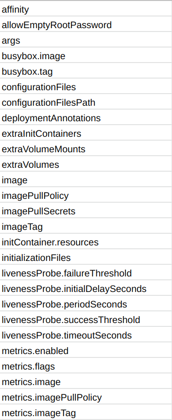
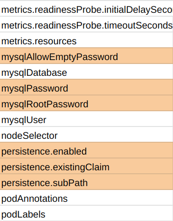

## The Goal

The [cdk8s](https://github.com/awslabs/cdk8s) is a powerful tool allowing DevOps engineers a new level of productivity in creating Infrastructure as Code. However, adoption will not be easy, as there is no easy path from existing charts to cdk8s constructs.

I wanted to see what it would take to convert a helm chart to a cdk8s construct, so I began with a semi-complex chart, [the stable mysql chart](https://github.com/helm/charts/tree/master/stable/mysql).

All the code referenced here is available at [this repo](). This is proof-of-concept code, and is not properly documented or production worthy.
## The Problem

When I first sat down to do the work I realized very quickly that trying to reverse engineer the various helm templates would result in a lot of mistakes.

More importantly, my unit tests would suffer from the same mistakes as the implementing code. I couldn't rely on my correct reading of the existing chart to ensure my conversion was right.

I decided to use helm itself as part of the testing by using helm output as snapshots to test against.

* run `helm template . > default.snapshot.yaml`
* test it by creating my new construct, using the exact `values.yaml` file, and then compare the synth to the snapshot

However, that only tested a small part of the overall template, so I needed more snapshots.

## The Solution

Getting 100% correct coverage required knowing all the combination of values that could be provided to the existing
helm charts and tested against. Each new 'values' file I created is called a 'variant'. The default `values.yaml` that's part of all
good helm charts is the first variant.

The default values files documented these values well, but I figured not all helm charts will, and I wanted a process
that still determined variants even without good documentation.

A simple Regex `.Values.` got me all Values used in the `deployment.yaml`:



Many of these references were simple, like:

```yaml
image: "{{ .Values.metrics.image }}:{{ .Values.metrics.imageTag }}"
```

But, there were a lot of 'if' usages (used `/if.*.Values./`), and those required special attention. If they are simple
'if's:

```yaml
{{- with .Values.deploymentAnnotations }}
  annotations:
{{ toYaml . | indent 4 }}
```

or

```yaml
      {{- if .Values.affinity }}
      affinity:
{{ toYaml .Values.affinity | indent 8 }}
      {{- end }}
```

These are just simple "null" checks and the second variant (setting all values) will exercise those conditionals.

But, sometimes I came across an 'if' with more complexity ( and / or ), like:

```yaml
        {{- if not (and .Values.allowEmptyRootPassword (not .Values.mysqlRootPassword)) }}
        - name: MYSQL_ROOT_PASSWORD
          valueFrom:
            secretKeyRef:
              name: {{ template "mysql.secretName" . }}
              key: mysql-root-password
              {{- if .Values.mysqlAllowEmptyPassword }}
              optional: true
              {{- end }}
        {{- end }}

```

I marked the `allowEmptyRootPassword` (which didn't even show up in the `values.yaml` or docs) and `mysqlRootPassword`
and `mysqlAllowEmptyPassword` with an orange color.

Persistence also gets marked as orange, since `persistence.existingClaim` and `persistence.subPath` are inherently
and 'AND' `with persistence.enabled`.



The second variant (variant-1) is actually really simple then: just set everything! Go down your list of values (don't
trust the default `values.yaml` to have these properly documented) and provide a value.

The tests for the second variant got created and after some more implementation they were all passing and I knew I had
a lot of coverage.

But, what about those pesky orange fields? For these I had to really reach back into the days of computer science at
CU Boulder or VT and try to remember my boolean math. In the end I think I got a pattern setup nicely. I'll walk you
through it for the PersistentVolumeClaim resource. This is representative (and much easier to follow, in my opinion)
of similar cases in the `deployment.yaml` template.

```yaml
{{- if and .Values.persistence.enabled (not .Values.persistence.existingClaim) }}
kind: PersistentVolumeClaim
apiVersion: v1
metadata:
  name: {{ template "mysql.fullname" . }}
  namespace: {{ .Release.Namespace }}
{{- with .Values.persistence.annotations  }}
  annotations:
{{ toYaml . | indent 4 }}
{{- end }}
  labels:
    app: {{ template "mysql.fullname" . }}
    chart: "{{ .Chart.Name }}-{{ .Chart.Version }}"
    release: "{{ .Release.Name }}"
    heritage: "{{ .Release.Service }}"
spec:
  accessModes:
    - {{ .Values.persistence.accessMode | quote }}
  resources:
    requests:
      storage: {{ .Values.persistence.size | quote }}
{{- if .Values.persistence.storageClass }}
{{- if (eq "-" .Values.persistence.storageClass) }}
  storageClassName: ""
{{- else }}
  storageClassName: "{{ .Values.persistence.storageClass }}"
{{- end }}
{{- end }}
{{- end }}
```

Line #1:
```yaml
{{- if and .Values.persistence.enabled (not .Values.persistence.existingClaim) }}
```

There are two variables in this logic, `enabled` and `existingClaim`, filling out the grid:

| |existingClaim|not existingClaim|
|---|---|---|
|enabled|❌|✅
|not enabled|❌|❌

(✅ means the template will render and ❌ means the template will not render)

In other words, the template is only rendered if persistence is enabled
and an existingClaim wasn't provided. At first glance I thought I needed 4 variants, but since the 'not enabled' makes
the 'existingClaim' an irrelevant check I knew I didn't need a variant for that condition as I still had coverage.

I then wrote into each box what variant represented that condition, or assigned variants if none existed:

| |existingClaim|not existingClaim|
|---|---|---|
|enabled|❌(variant-2)|✅ (default/variant-1)
|not enabled|❌(variant-3)|❌ (variant-3)

Notice that variant-1 also produces a PVC template. I could have chosen instead to modify variant-1 so
that it had a `existingClaim` and therefore would be in the upper left box. However, I didn't want to
modify an existing variant (and it'll be important later). Variants 2 and 3 haven't been created yet so their assignment
is arbitrary.

This now took care of that particular set of logic, but keep digging and you'll see
there is another AND in the template, lines:

```yaml
{{- if .Values.persistence.storageClass }}
{{- if (eq "-" .Values.persistence.storageClass) }}
  storageClassName: ""
{{- else }}
  storageClassName: "{{ .Values.persistence.storageClass }}"
```

This reads: if `persistence.storageClass` has been provided and is not '-' just pass that through.
If it was provided and is '-' then purposely put an empty field.

Working the grid again I end up with:

| |storageClass|not storageClass|
|---|---|---|
|is '-'|''|❌ (default)
|is not '-'|storageClass|❌ (default)

Notice the implicit AND here, that the template has to be rendered for any of this to matter. So now when I go to assign
variants to the two cases where `storageClass` is provided, it has to be with the `enabled` and `!existingClaim` as well.
Variant-1 already represents this scenario, so I'll reuse it.

| |storageClass|not storageClass|
|---|---|---|
|is '-'|'' (variant-4)|❌ (default)
|is not '-'|storageClass (variant-1)|❌ (default)

Variant-4 was then created and added to tests and variant-1 was updated to set the storageClass to something other than
'-'. The existing PVC should now be completely covered by all 5 variants.

I followed the same process for the Deployment resource:

```yaml
    {{- if not (and .Values.allowEmptyRootPassword (not .Values.mysqlRootPassword)) }}
    - name: MYSQL_ROOT_PASSWORD
      valueFrom:
        secretKeyRef:
          name: {{ template "mysql.secretName" . }}
          key: mysql-root-password
          {{- if .Values.mysqlAllowEmptyPassword }}
          optional: true
          {{- end }}
    {{- end }}
```

Those fields I mentioned before like `allowEmptyRootPassword`
 got put into a grid and worked like above:

| |allowEmptyRootPassword | not allowEmptyRootPassword
|---|---|---
|mysqlRootPassword|✅ |✅
|not mysqlRootPassword|❌ |✅

Since these variables have no overlap with the previous persistence variables, I was free to assign them to whatever
variants already existed:

| |allowEmptyRootPassword | not allowEmptyRootPassword
|---|---|---
|mysqlRootPassword|✅ (variant-2) |✅ (variant-1)
|not mysqlRootPassword|❌  (variant-3)|✅ (default)

The logic in the template only had a simple 'if':

```yaml
{{- if .Values.mysqlAllowEmptyPassword }}
optional: true
{{- end }}
```

So I picked to put the 'true' value in `variant-2` and 'false' value in `variant-4`.

I kept repeating this process until I had gone through all the template `.yaml` files.

## Conclusions

There were some aspects of the templates that didn't match one-to-one with a cdk8s construct. For example, when executing
a helm command you can provide a release name. This is used throughout most helm charts. The boilerplate code written by
the cdk8s-cli does not replicate any of this. I didn't add it to this proof-of-concept.

The mysql chart also includes a `_helpers.tpl` that had some functionality that should be specifically unit tested. Those
were pretty boring and routine unit tests so I didn't include them here.

It took a while to get there, but I believe I've been able to replicate all the functionality in the original helm chart.

I think I got it right, but if you see a flaw in my conversion, please open issues or pull requests against the
[github repo](https://github.com/mbonig/helm-to-cdk8s).


